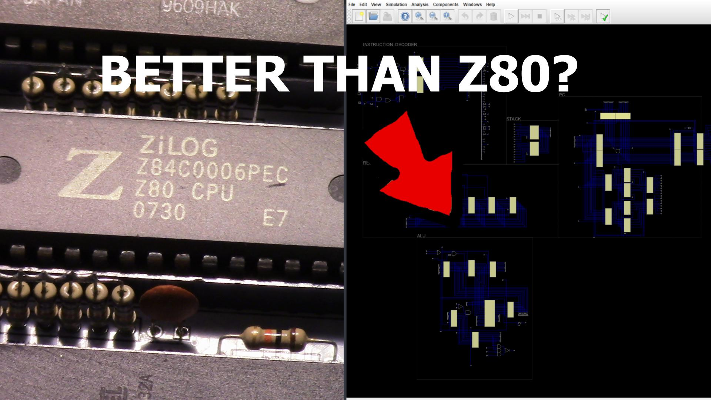
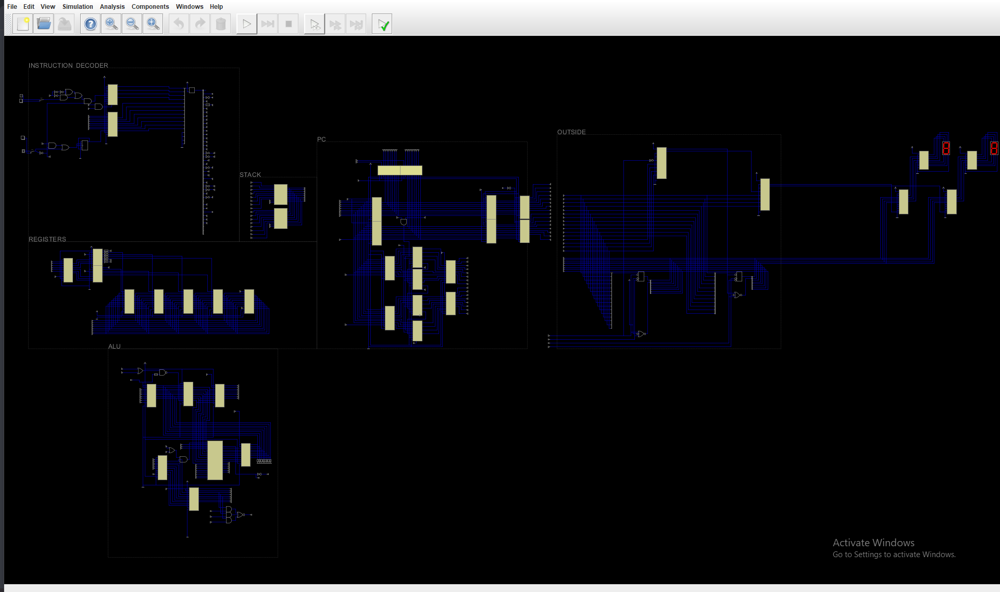

# Homemade 8-bit CPU

Watch Demo Video above!!

A homebrew 8-bit CPU designed from scratch that was inspired by classic CPUs like the 6502 and Z80.

BTW this repo is being updated so it might change the next time you see this.

## How I store stuff

- Go in src folder
- Choose a part or module of my CPU
- there will be a png containing the schematic
- there will also be a decription file with a description and a youtube link
- By the way .dig files are Digital files that I used to design my CPU link is down at the end of this file

## Why I Built This

I’m an 8th-grade student interested in CPU design, computer architecture, and how modern processors work internally.
This project is part of my journey toward building more advanced CPUs with pipelining, virtual memory, and out-of-order execution.

## Features
- 8-bit data bus
- 16-bit address bus
- Custom ISA
- Flags: Z, C, N
- Memory-mapped I/O
- Designed and implemented from scratch

## Architecture

Main components:
- ALU
- Register file
- Control unit
- Program counter
- Instruction decoder
- RAM / ROM

## Instruction Set

The instruction set is still not fully complete because 256 instructions is a lot!
I will probably update a this repo a few times.

See [`docs/instr.txt`](docs/instr.txt)

## Acknowledgements

BIG thanks to Hneemann for designing the software logic simulator Digital to make all this possible
- [Digital](https://github.com/hneemann/Digital) by Hneemann

